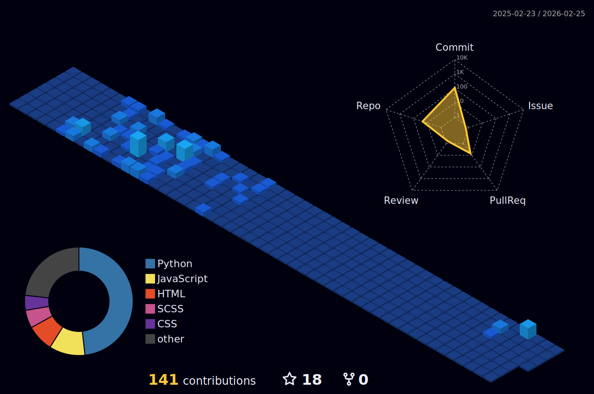

 

<h1 align="left">👋 Hello Dev ! Welcome my Github</h1>

###

<h6 align="left">I'm Pedro Ancelotti have 19 years and Developer Full Stack Jr </h6>

---

## 🚀 About me

<h4 align="left">💻 Full Stack Developer</h4>

Processes and projects driven by a passion for technology.

 
<h4 align="left">📚 Ongoing Education</h4>

  
🎓 Software Engineering Student

  
🐍 Full Stack Python

   
<h5> 🌟 Enthusiast of efficient, scalable, and secure solutions.</h5>

---

## 🛠️ Skills

| Languages | Framework | DevOps | Databases | IDEs | Dev Tools | Currently Learning |
|:---:|:---:|:---:|:---:|:---:|:---:|:---:|
| |  |||||  
|  |  || || |
||||| || 
| ||||||

  
---

## 📫 Contact

 &nbsp;&nbsp;
 &nbsp;&nbsp;
 

---

## 📢 Welcome to my Server

---

## 📊 GitHub Stats

